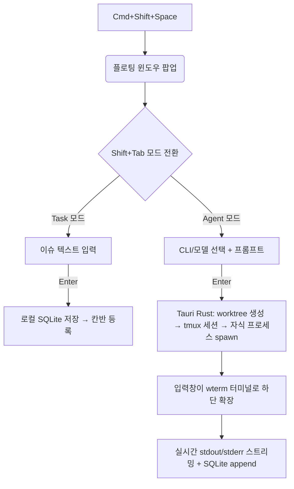

# 🚀 프로젝트 기획서 v2: Agentic Task & Terminal Manager (AgentFlow)

> **버전**: v2 (2026-05-16)
> **변경 요약**: 기능은 v1과 동일하게 유지하되, Phase 재조정 / Worktree·세션 영속성·OOM 대응 추가 / Agent Adapter·비용 추적·MCP 등은 후속 버전으로 이연 / Turso 동기화는 핵심 목표로 유지(Mac/Web/Mobile 멀티 클라이언트)

---

## 1. 프로젝트 개요 및 비전

**AgentFlow** 는 개인 개발자의 생산성을 극대화하기 위한 '에이전트 기반 작업 관리자 + 통합 터미널'입니다. 전역 단축키로 호출되는 플로팅 윈도우에서 할 일을 입력하면, 즉시 자율형 코딩 에이전트의 터미널 세션으로 변환되거나 일반 이슈로 기록됩니다.

Local-first 아키텍처로 오프라인에서도 즉각 반응하며, 백그라운드의 여러 에이전트 작업을 칸반 보드로 통합 관리합니다. **개인 도구지만 Mac(주 작업 환경) / Web / Mobile 다중 클라이언트에서 동일한 보드를 사용**하는 것이 핵심 목표입니다 — 단, 에이전트 실행은 Mac 데스크톱 클라이언트 전용이며 Web/Mobile은 보드 조회·티켓 작성·원격 트리거(후속) 용도.

### 1.1 만드는 이유 (Why)
기존 도구들(Conductor, Crystal, 단일 터미널 에이전트 등)을 쓰다 느낀 불편함을 **본인 워크플로우에 맞게 직접 해결**하는 것이 목적. 차별화·ROI는 의사결정 기준이 아니며, **만들고 싶은 기능을 v1~v3에 걸쳐 모두 구현**하는 것이 방향.

### 1.2 핵심 설계 원칙
- **Local-first, sync-augmented**: 모든 동작은 로컬에서 즉시 완결, 동기화는 보조 레이어
- **Yolo by default**: 권한 모델은 yolo 모드를 기본 가정으로 단순화 (정교한 정책 모델은 후속)
- **Resilience over polish**: 앱·시스템 크래시 시에도 에이전트 작업이 유실되지 않도록 우선 설계
- **Defer complexity**: Agent Adapter / MCP / 정교한 권한 시스템 등은 v1에서 의도적으로 단순화

---

## 2. 유사 프로젝트 (참고용)

- **Muxy** — Tauri 기반 AI 친화 터미널. 기술 스택 레퍼런스로 활용
- **Conductor.build** — Git worktree + 에이전트 오케스트레이션 패턴 참고
- **Raycast / Spotlight** — 플로팅 UI 호출 패턴
- **Linear** — Local-first 칸반의 키보드 친화적 UX
- **Cursor / Windsurf** — 에이전트-터미널-에디터 통합 UX

---

## 3. 기능 명세 (Feature Specification)

> Phase 정보는 §6에서 별도 관리. 본 섹션은 기능 자체의 기술적 명세에 집중.

### 3.1 옴니 인풋 플로팅 윈도우

| 항목 | 명세 |
|---|---|
| 호출 단축키 | `Cmd+Shift+Space` (커스터마이즈 가능) |
| 모드 토글 | `Shift+Tab` 으로 Task ↔ Agent 즉시 전환 |
| Task 모드 | 단순 이슈 텍스트 입력 → Enter → 로컬 DB 저장 → 칸반 백로그 |
| Agent 모드 | 드롭다운으로 CLI 도구(Claude Code / Codex CLI / Gemini CLI / Qwen CLI) + 모델 선택 → 프롬프트 입력 → Enter → 자식 프로세스 spawn |
| 최근값 자동 저장 | 마지막 성공 케이스 자동 기억 |
| 터미널 트랜지션 | Agent 실행 시 입력창이 하단으로 확장되며 wterm 터미널로 변환, stdout/stderr 실시간 스트리밍 |

> **CLI 옵션 UI**: 별도의 Agent Adapter 추상화 계층은 두지 않음. 각 CLI의 옵션 플래그를 폼 형태로 노출하는 단순 UI 우선. 향후 고도화 시 설정 화면으로 분리.



### 3.2 Git Worktree 기반 격리 실행 🆕

각 Agent 티켓은 **자체 git worktree** 에서 실행되어 동시 다발적 에이전트 작업이 충돌하지 않도록 보장.

| 항목 | 명세 |
|---|---|
| 생성 시점 | Agent 티켓 spawn 시 자동으로 `.agentflow/worktrees/<ticket-id>` 경로에 worktree 생성 |
| 브랜치 명명 | `agentflow/<workspace>/<short-title-slug>-<ticket-id>` |
| **커스텀 초기화 스크립트** 🆕 | Workspace 설정에서 `pre_agent.sh` / `post_worktree.sh` 같은 훅 지정 가능 (예: `pnpm install`, `.env` 복사, `direnv allow`) |
| **커스텀 인스트럭션** 🆕 | Workspace 단위로 worktree에 주입할 시스템 프롬프트 파일(`CLAUDE.md`, `AGENTS.md` 등) 자동 복사·머지 규칙 정의 |
| 정리 | 티켓 완료 시 머지(수동) 후 `git worktree remove` 옵션 제공. Dirty 상태면 보존. |

### 3.3 통합 칸반 대시보드

| 항목 | 명세 |
|---|---|
| 컬럼 | Backlog → To-Do → In Progress (Human / Agent / **Waiting** / **Failed**) → Done |
| 티켓 통합 | 수동 Task와 Agent 티켓을 동일 보드에서 관리, 시각적 구분(아이콘·뱃지) |
| 상태 추적 | 각 CLI의 hook/이벤트 API 활용 (Claude Code stop hook, PreToolUse 등) |
| 어태치/디태치 | 티켓 클릭 시 해당 tmux 세션을 오버레이로 attach. 닫으면 detach (세션은 살아있음) |
| 키보드 네비게이션 | Linear 스타일 — `j/k` 이동, `e` 편집, `Cmd+Enter` 상태 변경 |

### 3.4 백그라운드 프로세스 풀 (tmux 기반) 🔧

| 항목 | 명세 |
|---|---|
| 세션 관리 | 각 에이전트는 `tmux new-session -d -s agentflow-<ticket-id>` 로 detached 실행 |
| 앱 크래시 복구 | 앱 재시작 시 `tmux ls` + SQLite session metadata 비교 → 고아 세션을 칸반에 복원 |
| 출력 영속화 | stdout/stderr를 `tmux pipe-pane` 으로 캡처하여 `.agentflow/logs/<ticket-id>.log` 에 append (Replay 기능의 기반) |
| 동시 실행 제한 | 기본 N=3, 설정 변경 가능. 초과 시 큐잉(Waiting 컬럼) |
| 메모리 워치독 | Tauri 백엔드가 각 자식 프로세스 RSS 주기 모니터링 — soft limit 도달 시 OS 알림, hard limit 도달 시 강제 종료 후 Failed 처리 |
| 시스템 OOM 대응 | tmux 세션은 별도 프로세스 트리에 있어 OS OOM killer가 앱만 죽일 가능성 높음 → 재시작 후 자동 복구 |

### 3.5 양방향 에이전트 제어 (CLI Bridge → MCP로 격상) 🔧

> **변경**: v1은 MCP가 아닌 **CLI Bridge 방식**으로 단순 구현. MCP는 v2+에서 격상.

#### v1: CLI Bridge
- AgentFlow 앱이 작은 CLI 바이너리(`agentflow`)를 PATH에 설치
- 에이전트는 Bash 도구로 다음과 같은 명령 호출:
  ```
  agentflow subtask add "리팩토링 1단계: 인터페이스 추출"
  agentflow status update <ticket-id> done
  agentflow comment add <ticket-id> "테스트 통과 확인"
  ```
- 내부적으로 Unix domain socket으로 앱과 IPC, 환경변수 `AGENTFLOW_TICKET_ID` 로 권한 스코프 자동 결정
- **장점**: MCP 미지원 CLI도 즉시 호환, 구현 단순, 디버깅 쉬움

#### v2+: 로컬 MCP 서버로 격상
- Tauri Rust 백엔드에서 MCP 서버 호스팅 (Unix socket / named pipe transport)
- `read_workspace`, `create_subtask`, `update_ticket_status` 등 풍부한 도구 제공
- Discovery는 spawn 시 환경변수(`AGENTFLOW_MCP_URL`, `AGENTFLOW_TICKET_ID`) 주입

### 3.6 Workspace 컨텍스트

| 항목 | 명세 |
|---|---|
| 작업 디렉토리 설정 | 워크스페이스 단위로 로컬 폴더 경로 + 기본 브랜치 + 초기화 스크립트 지정 |
| 파일 트리 탐색기 | 사이드바 또는 오버레이로 경량 파일 트리 (v2) |
| Open in Editor | 파일/폴더 우클릭 → "Open in Cursor/VS Code" 액션 (v1 포함) |
| Markdown 렌더러 | `.md` 파일 클릭 시 Raw ↔ Rendered 탭 스위칭, 에이전트가 생성한 PRD/리포트 즉시 확인 (v1 포함) |
| 일반 파일 뷰어 | 코드 파일 read-only 뷰 (v2+) |

### 3.7 네이티브 OS 알림

| 트리거 | 알림 내용 예시 |
|---|---|
| 승인 대기 | "Claude Code가 `src/App.tsx` 수정을 완료하고 승인을 기다리고 있습니다." |
| 에러 발생 | "Codex CLI 세션이 실패했습니다 (#42)." |
| 작업 완료 | "리팩토링 티켓이 Done으로 이동했습니다." |
| 메모리 임계치 | "Agent 세션 RSS가 4GB를 초과했습니다." |

- Tauri Notification API 사용
- 알림 클릭 → 앱 포커스 + 해당 티켓 오버레이 자동 팝업

### 3.8 권한/승인 모델 (Simplified)

- **v1 기본 가정**: yolo mode (= Claude Code의 `--dangerously-skip-permissions` 류)
- 그 외 모드는 워크스페이스 설정으로 노출만 해두고, 정교한 정책 엔진은 v3+로 이연
- 시각적 표시: yolo 워크스페이스는 카드에 ⚠️ 뱃지 표시

---

## 4. 기술 스택 아키텍처

### 4.1 프론트엔드 & 코어

| 레이어 | 선택 | 비고 |
|---|---|---|
| Frontend | React + TypeScript + TailwindCSS | |
| 터미널 렌더링 | **wterm** (1순위) → 통합 이슈 시 **xterm.js** fallback | DOM 기반 렌더링·접근성 우선, Muxy와 무관한 선택 |
| 데스크톱 프레임워크 | Tauri v2 (Rust) | PTY는 `portable-pty` crate, tmux는 외부 바이너리 의존 |
| Mobile/Web 클라이언트 | React Native (Mobile) / Next.js (Web) | 보드 조회 + 티켓 작성 전용, 에이전트 실행 X |
| IPC (CLI Bridge) | Unix domain socket (macOS/Linux) + named pipe (Windows) | |

### 4.2 데이터 계층: Local-first + Multi-client Sync

```
┌─ Mac Desktop (Tauri) ─┐         ┌─ Web (Next.js) ─┐    ┌─ Mobile (RN) ─┐
│  SQLite (embedded)    │         │  libSQL client  │    │  libSQL client│
│  + tmux + worktree    │         └────────┬────────┘    └───────┬──────┘
│  + CLI bridge socket  │                  │                     │
└─────────┬─────────────┘                  │                     │
          │                                ▼                     │
          └────────► Turso (libSQL Embedded Replica) ◄───────────┘
```

- **로컬 DB**: SQLite (Mac 클라이언트의 원본 데이터)
- **원격 DB**: Turso (libSQL) — Embedded Replica로 양방향 동기화
- **충돌 해소 전략**: 작성 시점 기반 last-write-wins (개인 사용자라 보수적 정책으로 충분), 상태 변경은 server-stamp
- **에이전트 실행 데이터(stdout 로그)**: 동기화 제외 — 용량 폭주 방지, 로컬 전용

### 4.3 데이터 모델 스케치

```
Workspace
  id, name, root_path, default_branch, pre_agent_script, custom_instructions, permission_mode, created_at

Ticket
  id, workspace_id, type [task|agent], title, description, status [backlog|todo|in_progress|waiting|failed|done],
  parent_ticket_id (서브태스크용), assignee [human|<agent-id>], created_at, updated_at, sync_version

AgentSession
  id, ticket_id, cli_tool, model, options_json, tmux_session_name, worktree_path,
  pid, started_at, finished_at, exit_code

SessionEvent (로컬 전용, 동기화 X)
  id, session_id, ts, kind [stdout|stderr|hook|notification], payload

Comment
  id, ticket_id, author [human|<agent-id>], body, created_at
```

---

## 5. 운영 이슈 & 리스크 대응 🆕

| 리스크 | 대응 |
|---|---|
| 다수 에이전트 동시 실행으로 인한 OOM | 동시 실행 제한 N=3 (기본) + 메모리 워치독 + Waiting 컬럼 큐잉 |
| 앱 크래시로 인한 작업 유실 | tmux detached 세션으로 분리 → 재시작 시 `tmux ls` 기반 복원 |
| 시스템 OOM kill | tmux 세션이 별도 프로세스 트리라 생존 가능성 ↑ |
| Turso 동기화 충돌 | last-write-wins + sync_version 컬럼 + 충돌 발생 시 알림 |
| CLI 도구 stdout 포맷 변경 | 텍스트 파싱 최소화, hook 우선 (Claude Code 등) — 파싱 실패해도 raw 로그는 보존 |
| Worktree 디스크 누적 | 티켓 Done 1주 이상 경과 시 정리 알림 |

---

## 6. 단계별 개발 플랜 (Revised)

### Phase 0 — Spike (1주)
- Tauri v2 + wterm 통합 검증 (안 되면 xterm.js fallback 결정)
- `portable-pty` + tmux 외부 의존 PoC
- 글로벌 단축키 macOS 동작 확인

### Phase 1 — MVP: 단일 에이전트 실행 + 칸반
- 플로팅 윈도우 + Task/Agent 모드 토글 UI
- Workspace 설정 (디렉토리 + 초기화 스크립트 + 커스텀 인스트럭션)
- **Git worktree 자동 생성** + 커스텀 스크립트 실행
- 단일 에이전트 spawn (Claude Code 우선) + wterm 출력
- 로컬 SQLite + 칸반 보드 (Linear 스타일 키보드 네비)
- tmux detached 세션 + 앱 재시작 복구
- 동시 실행 제한 + 메모리 워치독
- Yolo 모드 기본 가정

### Phase 2 — 멀티 에이전트 + 알림 + UX 보강
- 추가 CLI 통합 (Codex / Gemini / Qwen) — 단순 옵션 UI
- Hook 기반 칸반 상태 자동 업데이트
- 네이티브 OS 알림 (승인 대기 / 에러 / 완료 / 메모리 임계)
- **CLI Bridge** (`agentflow` CLI + Unix socket) — 에이전트가 서브태스크 생성/수정 가능
- 어태치/디태치 오버레이 UX 완성
- **Markdown 렌더러** (Raw ↔ Rendered 탭)
- Open in Editor 액션

### Phase 3 — Sync & Multi-client
- Turso 연동 + Embedded Replica 설정
- 동기화 충돌 처리 (last-write-wins + sync_version)
- Web 클라이언트 (Next.js) — 보드 조회 + 티켓 작성
- Mobile 클라이언트 (React Native) — 동일 범위
- 동기화 제외 컬럼(stdout 로그) 분리

### Phase 4 — Polish & 확장
- 파일 트리 탐색기 + 일반 파일 뷰어
- **MCP 서버로 CLI Bridge 격상** (선택)
- 세션 Replay (저장된 stdout 재생)
- Diff 뷰어 (worktree 결과 머지 전 검토)
- 프롬프트 히스토리 검색
- 권한 모델 정교화 (필요 시)

---

## 7. Non-goals (의도적으로 안 함)

- 팀 협업 / 멀티 유저 권한 / SaaS화
- IDE 대체 (Cursor/VS Code를 외부 에디터로 활용)
- 비용/토큰 추적 — 정액제 플랜 사용 전제로 불필요
- 정교한 권한 정책 엔진 — yolo mode가 기본
- 클라우드 에이전트 실행 — 데스크톱 전용
- 차별화 / 마케팅 / 시장 분석

---

## 8. v1 검증 기준 (개인용 dogfood)

- [ ] 플로팅 윈도우 호출 → 에이전트 spawn 까지 3초 이내
- [ ] Mac 재부팅 후에도 진행 중이던 에이전트 작업 복구 가능
- [ ] 동시에 3개 에이전트 무리 없이 실행
- [ ] worktree 격리로 동시 작업 간 충돌 0건
- [ ] 일주일간 dogfood 후 기존 도구로 돌아갈 이유 없음
