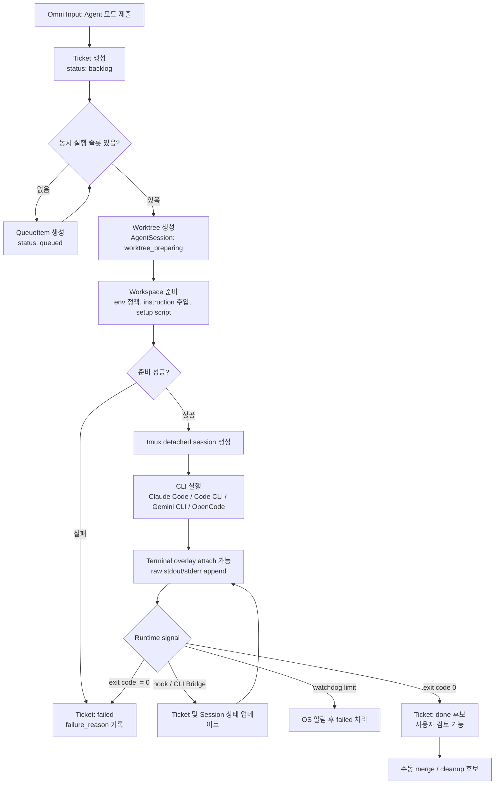
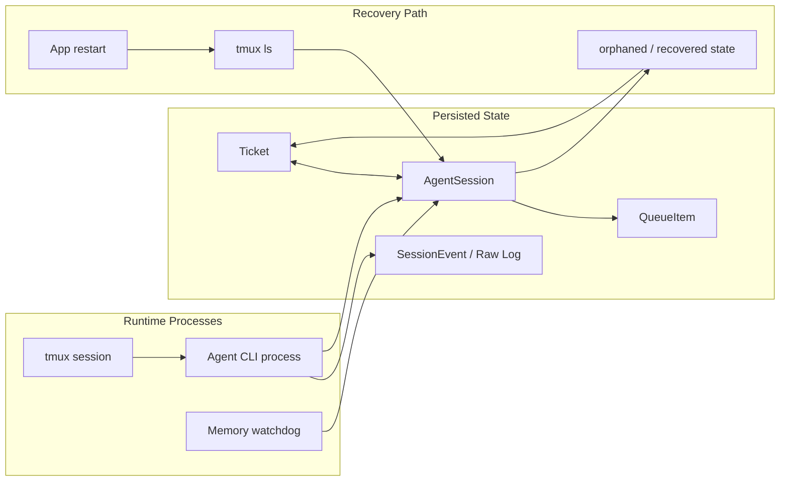
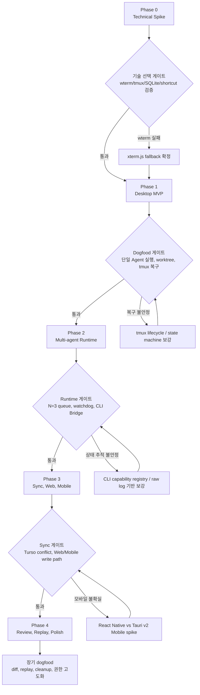
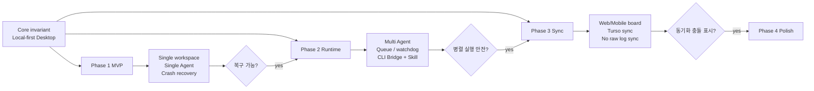

# 프로젝트 기획서 v3: Agentic Task & Terminal Manager (AgentFlow)

> **버전**: v3 (2026-05-16)
> **기준 문서**: `plan.v2.md`
> **작성 목적**: v2 기능 범위는 유지하되, 누락된 결정 지점·운영 리스크·phase별 우선순위·검증 게이트를 보강한 overview plan

---

## 1. 방향성

**AgentFlow**는 개인 개발자를 위한 local-first 에이전트 작업 관리자이자 통합 터미널이다. 전역 단축키로 호출되는 플로팅 입력창에서 Task 또는 Agent 티켓을 만들고, Agent 티켓은 Mac 데스크톱에서 git worktree + tmux 세션으로 실행된다. Web/Mobile은 동일 보드 조회와 티켓 작성 중심이며, 실제 에이전트 실행은 Mac 클라이언트가 담당한다.

이번 v3의 핵심 조정은 기능 축소가 아니라 **구현 순서와 실패 대응을 명확히 하는 것**이다. 기능은 대부분 구현 예정이므로 "필요한가"보다 "언제 구현해야 리스크가 낮은가", "어떤 검증을 통과해야 다음 phase로 넘어갈 수 있는가"에 초점을 둔다.

### 1.1 핵심 원칙

- **Mac desktop first**: 에이전트 실행, PTY, tmux, worktree, OS 알림은 Mac 데스크톱에서 먼저 완성한다.
- **Local-first before sync**: SQLite 기반 로컬 모델과 복구 가능성이 검증되기 전 Turso/Web/Mobile을 붙이지 않는다.
- **State machine first**: 칸반 UI보다 먼저 Ticket/AgentSession 상태 전이를 명확히 정의한다.
- **Raw log always wins**: hook 파싱이나 상태 추론이 실패해도 원본 stdout/stderr와 session metadata는 남긴다.
- **Skill over protocol lock-in**: MCP 서버를 조기 도입하기보다, `agentflow` CLI와 각 에이전트용 Skill/Instruction 패키지로 호환성을 확보한다.
- **Yolo by default, visible by design**: yolo 실행은 기본값으로 두되, 위험 모드 표시와 workspace 단위 설정은 v1부터 둔다.

---

## 2. 참고 프로젝트와 적용 범위

- **Muxy**: SwiftUI + libghostty 기반 AI 친화 터미널. Tauri 레퍼런스가 아니라 터미널 UX, 에이전트 세션 표시, AI 친화 패턴 참고 대상으로 본다.
- **Conductor.build**: git worktree 기반 병렬 에이전트 작업과 결과 검토 흐름 참고.
- **Raycast / Spotlight**: 전역 단축키, 빠른 입력, foreground overlay 호출 패턴 참고.
- **Linear**: 키보드 중심 칸반, 빠른 이슈 생성, 상태 변경 UX 참고.
- **Cursor / Windsurf**: 에이전트-터미널-에디터 연결 UX 참고.

---

## 3. 기능 범위

### 3.1 옴니 인풋 플로팅 윈도우

| 항목 | v3 명세 |
|---|---|
| 호출 단축키 | 기본값 `Cmd+Shift+Space`, 사용자 설정에서 변경 가능 |
| 모드 | Task / Agent |
| 모드 토글 | 기본 `Shift+Tab`, 추후 설정 가능 |
| Task 모드 | 입력 즉시 `backlog` 티켓 생성 |
| Agent 모드 | CLI 도구(Claude Code / Code CLI / Gemini CLI / OpenCode), 모델, 옵션 선택 후 Agent 티켓 생성 |
| Agent 티켓 상태 | 생성 시 `backlog`, 실행 큐 진입 시 `queued`, 프로세스 시작 시 `running`, 승인/입력 대기 시 `waiting`, 실패 시 `failed`, 완료 시 `done` |
| 최근값 | workspace, CLI, 모델, 주요 옵션의 마지막 성공값 저장 |
| 터미널 전환 | Agent 실행 시 입력창이 터미널 오버레이로 확장되고 stdout/stderr를 실시간 표시 |

### 3.2 칸반과 상태 모델

v2의 `In Progress (Human / Agent / Waiting / Failed)` 구조는 UI 관점에서는 이해하기 쉽지만, 데이터 모델에서는 status와 assignee/type이 섞일 위험이 있다. v3에서는 데이터 모델을 분리한다.

| 개념 | 값 |
|---|---|
| `Ticket.type` | `task`, `agent` |
| `Ticket.status` | `backlog`, `todo`, `queued`, `running`, `waiting`, `failed`, `done`, `archived` |
| `Ticket.assignee_type` | `human`, `agent`, `none` |
| `AgentSession.state` | `created`, `worktree_preparing`, `queued`, `starting`, `running`, `waiting_input`, `exited`, `failed`, `orphaned`, `recovered` |

UI 컬럼은 데이터 status를 그대로 노출하지 않아도 된다. 예를 들어 `queued`와 `waiting`은 Kanban에서 Agent lane 내부에 표시하고, `failed`는 별도 attention lane으로 보여줄 수 있다.

### 3.3 Agent 실행 파이프라인

Agent 티켓 실행은 다음 순서로 고정한다.





1. Ticket 생성: Agent 모드 입력을 `backlog`에 기록한다.
2. Queue 등록: 동시 실행 제한을 확인하고 실행 가능하면 `queued`로 이동한다.
3. Worktree 생성: `.agentflow/worktrees/<ticket-id>`에 worktree와 branch를 만든다.
4. Workspace 준비: `.env` 복사, instruction 파일 주입, 초기화 스크립트 실행 여부를 기록한다.
5. tmux 세션 생성: `agentflow-<ticket-id>` 형식으로 detached session을 만든다.
6. CLI 실행: 선택한 CLI별 command template과 옵션을 사용해 프로세스를 시작한다.
7. Log capture: `tmux pipe-pane` 또는 PTY capture로 raw log를 append한다.
8. State update: hook, exit code, CLI Bridge 호출, watchdog 이벤트로 상태를 갱신한다.
9. Recovery: 앱 재시작 시 SQLite metadata와 `tmux ls`를 비교해 세션을 복구한다.

### 3.4 지원 CLI

v3 기준 지원 대상은 다음 4개로 고정한다.

- Claude Code
- Code CLI
- Gemini CLI
- OpenCode

초기 구현은 Claude Code를 1순위로 두고, 나머지는 CLI별 옵션 UI와 실행 template을 추가하는 방식으로 확장한다.

### 3.5 CLI Bridge와 AgentFlow Skill

v1에서는 `agentflow` CLI 바이너리를 제공해 에이전트가 작업 상태를 직접 업데이트할 수 있게 한다.

```bash
agentflow subtask add "리팩토링 1단계: 인터페이스 추출"
agentflow status update "$AGENTFLOW_TICKET_ID" done
agentflow comment add "$AGENTFLOW_TICKET_ID" "테스트 통과 확인"
```

v2+에서는 MCP 서버보다 **AgentFlow Skill/Instruction 패키지**가 더 적절하다. 이유는 지원 대상 CLI들이 동일한 protocol/tooling 모델을 공유한다고 가정하기 어렵고, 개인용 local-first 앱에서는 CLI 명령 + 환경변수 + instruction 주입이 더 디버깅하기 쉽기 때문이다.

Skill 패키지는 다음을 포함한다.

- 각 CLI가 읽을 수 있는 instruction 파일 템플릿
- `AGENTFLOW_TICKET_ID`, `AGENTFLOW_WORKSPACE_ID`, `AGENTFLOW_SOCKET` 사용법
- 상태 업데이트, 서브태스크 생성, 코멘트 추가 명령 예시
- 실패 시 raw log를 남기고 수동 복구하는 절차

### 3.6 Worktree와 workspace 준비

| 항목 | v3 명세 |
|---|---|
| 생성 경로 | `.agentflow/worktrees/<ticket-id>` |
| 브랜치 | `agentflow/<workspace-slug>/<ticket-slug>-<ticket-id>` |
| 초기화 스크립트 | `post_worktree`, `pre_agent`를 workspace 설정으로 관리 |
| instruction 주입 | `CLAUDE.md`, `AGENTS.md`, 기타 CLI별 instruction 파일 복사 또는 append |
| secrets | 기본은 자동 복사하지 않음. workspace 설정에서 명시적으로 허용 |
| 정리 | Done 후 수동 머지/삭제. dirty worktree는 자동 삭제 금지 |

초기화 스크립트는 가장 큰 지연 요인 중 하나다. v1에서는 "항상 실행"보다 "workspace별 default + ticket별 override" 구조가 필요하다.

### 3.7 터미널/PTY 전략

v2의 wterm 우선 전략은 유지하되, Phase 0에서 다음을 반드시 검증한다.

- Tauri v2 WebView 내 wterm 렌더링 성능
- tmux attach/detach와 wterm 입력 처리 호환성
- `portable-pty` 단독 capture와 `tmux pipe-pane` capture 중복 문제
- xterm.js fallback 비용
- macOS에서 tmux 미설치 또는 버전 차이 대응

v1 구현은 "예쁜 터미널"보다 "세션 유실 없음"이 우선이다. wterm 문제가 길어지면 xterm.js로 전환하고, wterm은 v2 UX 개선으로 이연한다.

### 3.8 Web/Mobile

Web은 Next.js를 기본 후보로 둔다. Mobile은 React Native를 기본 후보로 보되, **Tauri v2 Mobile 활용 가능성을 Phase 3 진입 전에 별도 spike로 검토**한다.

Mobile/Web의 v1 범위는 다음으로 제한한다.

- 보드 조회
- Task 티켓 작성
- Agent 티켓 draft 작성
- Mac desktop에서 실행할 원격 trigger는 후속

---

## 4. 기술 아키텍처

### 4.1 레이어

| 레이어 | 선택 |
|---|---|
| Desktop app | Tauri v2 + React + TypeScript |
| Backend core | Rust command handlers + SQLite |
| Terminal | wterm 우선, xterm.js fallback |
| Session manager | tmux |
| PTY | `portable-pty` 검토, tmux attach path와 역할 분리 |
| Local DB | SQLite |
| Sync | Turso/libSQL Embedded Replica |
| Web | Next.js |
| Mobile | React Native 또는 Tauri v2 Mobile 검토 |
| Agent control | `agentflow` CLI + Unix domain socket + Skill/Instruction 패키지 |

### 4.2 데이터 모델 보강

```text
Workspace
  id, name, slug, root_path, default_branch
  permission_mode, default_cli_tool, default_model
  post_worktree_script, pre_agent_script
  instruction_policy_json, env_copy_policy_json
  created_at, updated_at

Ticket
  id, workspace_id, type, title, description
  status, assignee_type, parent_ticket_id
  priority, created_at, updated_at, completed_at
  sync_version, last_local_event_id

AgentSession
  id, ticket_id, cli_tool, model, options_json
  state, tmux_session_name, worktree_path, branch_name
  pid, process_group_id, started_at, finished_at
  exit_code, failure_reason

SessionEvent
  id, session_id, ticket_id, ts
  kind, payload, local_only

QueueItem
  id, ticket_id, workspace_id, priority
  state, enqueued_at, started_at

Comment
  id, ticket_id, author_type, body
  created_at, sync_version
```

`SessionEvent`와 raw log는 기본적으로 동기화하지 않는다. sync 대상은 Workspace, Ticket, Comment, 일부 AgentSession metadata로 제한한다.

### 4.3 상태 전이 원칙

- UI drag/drop은 `Ticket.status`를 변경한다.
- Agent runtime은 `AgentSession.state`를 변경하고 필요한 경우 `Ticket.status`를 반영한다.
- hook 실패만으로 세션을 실패 처리하지 않는다. exit code, timeout, watchdog, 수동 판정 중 하나가 필요하다.
- 앱 재시작 후 tmux 세션은 있는데 DB state가 불명확하면 `orphaned`로 표시하고 사용자에게 복구/종료 선택지를 제공한다.

---

## 5. Phase 계획





### Phase 0 — Technical Spike

**목표**: 핵심 기술 선택이 가능한지 검증한다. 제품 UX를 만들기 전에 실패 가능성이 큰 의존성을 먼저 확인한다.

필수 작업:

- Tauri v2 + React shell 생성
- 글로벌 단축키 등록/해제 검증
- wterm 렌더링 spike와 xterm.js fallback 비교
- tmux 설치 확인, session 생성, attach/detach, pipe-pane capture PoC
- SQLite migration 방식 결정
- macOS notification click-to-focus 검증
- Claude Code 단일 spawn PoC

통과 기준:

- 전역 단축키로 floating window를 열 수 있다.
- tmux detached session이 앱 종료 후에도 살아남는다.
- raw stdout/stderr가 로컬 파일 또는 DB event로 append된다.
- wterm 사용 여부를 결정한다. 실패 시 xterm.js fallback을 v1 기본값으로 확정한다.

### Phase 1 — Desktop MVP

**목표**: Mac에서 단일 workspace, 단일 Agent 실행, 칸반 복구까지 dogfood 가능한 최소 제품을 만든다.

포함 범위:

- Workspace CRUD
- Task/Agent omni input
- Agent 티켓 생성 후 Backlog 등록
- Claude Code 실행
- git worktree 생성
- tmux detached session
- terminal overlay attach/detach
- SQLite 기반 Ticket/AgentSession/SessionEvent 저장
- 앱 재시작 시 tmux 세션 복구
- yolo mode 표시
- Open in Editor
- Markdown raw/rendered viewer

제외 범위:

- Turso sync
- Web/Mobile
- 다중 CLI
- 정교한 권한 정책
- replay/diff 고급 UI

통과 기준:

- floating input에서 Agent 티켓을 만들고 3초 내 실행 큐 또는 running 상태로 전환된다.
- 앱을 강제 종료해도 tmux session과 raw log가 남는다.
- 앱 재시작 후 진행 중 세션을 칸반에서 다시 attach할 수 있다.
- worktree가 원본 repo와 분리되어 변경사항을 만든다.

### Phase 2 — Multi-agent Runtime

**목표**: 여러 에이전트를 안전하게 병렬 실행하고, 상태/알림/대기열을 안정화한다.

포함 범위:

- 동시 실행 제한 기본 N=3
- QueueItem 기반 `queued` 상태
- 메모리 watchdog
- OS 알림: 완료, 실패, 승인/입력 대기, 메모리 임계치
- Code CLI / Gemini CLI / OpenCode 추가
- CLI별 옵션 form
- hook 기반 상태 업데이트
- `agentflow` CLI Bridge
- AgentFlow Skill/Instruction 패키지 초안
- 서브태스크 생성 및 칸반 반영

통과 기준:

- 동시에 3개 Agent를 실행하고 4번째는 `queued`로 유지된다.
- CLI Bridge로 생성한 subtask가 parent ticket 아래에 기록된다.
- 한 세션 실패가 다른 세션의 상태와 worktree를 손상하지 않는다.
- watchdog 이벤트가 ticket status와 notification으로 이어진다.

### Phase 3 — Sync, Web, Mobile

**목표**: Desktop local-first 모델을 유지하면서 Web/Mobile 조회와 티켓 작성 흐름을 붙인다.

포함 범위:

- Turso/libSQL Embedded Replica
- sync 대상 테이블 확정
- conflict policy: 개인용 last-write-wins + conflict notification
- Web board viewer/writer
- Mobile board viewer/writer
- Mobile 기술 선택 spike: React Native vs Tauri v2 Mobile
- 로그/세션 이벤트 동기화 제외 정책 구현

통과 기준:

- Mac에서 만든 Task 티켓이 Web/Mobile에 반영된다.
- Web/Mobile에서 만든 Task 티켓이 Mac desktop에 반영된다.
- Agent raw log는 sync되지 않는다.
- 충돌 발생 시 silent overwrite가 아니라 사용자에게 표시된다.

### Phase 4 — Review, Replay, Polish

**목표**: dogfood 중 반복적으로 필요한 검토/정리/검색 기능을 추가한다.

포함 범위:

- Diff viewer
- session replay
- prompt history search
- file tree와 read-only code viewer
- worktree cleanup assistant
- 권한 모델 고도화
- AgentFlow Skill 패키지 개선

통과 기준:

- 완료된 Agent 티켓의 변경사항을 앱 안에서 검토할 수 있다.
- 오래된 worktree/log 정리 후보를 안전하게 식별한다.
- 권한 모드가 workspace별로 명확히 표시되고 변경 가능하다.

---

## 6. 주요 리스크와 대응

| 리스크 | 영향 | 대응 |
|---|---|---|
| wterm 통합이 예상보다 불안정 | v1 일정 지연 | Phase 0에서 fallback 결정. xterm.js를 즉시 대체 경로로 유지 |
| tmux 외부 의존성 | 신규 환경에서 실행 실패 | 앱 시작 시 dependency check, 설치 가이드, fallback 안내 |
| CLI별 동작 방식 차이 | 상태 추적 불안정 | 공통 abstraction보다 CLI별 command template + capability registry 우선 |
| hook 파싱 실패 | 칸반 상태 부정확 | raw log 보존, exit code와 CLI Bridge 이벤트를 보조 signal로 사용 |
| worktree 초기화 지연 | Agent spawn 3초 기준 실패 | 티켓 생성과 실행 준비를 분리. UI는 queued/preparing 상태를 즉시 표시 |
| dependency install 중복 | 디스크/시간 낭비 | workspace별 setup script를 명시하고, 캐시/skip 옵션 제공 |
| secrets 자동 복사 위험 | 보안 사고 | 기본 비활성화. 사용자가 허용한 파일만 복사 |
| yolo mode 위험 | 원치 않는 파일 변경 | workspace 단위 표시, worktree 격리, diff review 강화 |
| 앱 크래시 | UI 상태 유실 | tmux + SQLite metadata + raw log로 복구 |
| 시스템 OOM | 세션 강제 종료 | 동시 실행 제한, watchdog, hard limit 실패 처리 |
| Turso 충돌 | 상태 뒤섞임 | Phase 3까지 이연. server-stamp와 conflict notification 구현 |
| Mobile 기술 선택 불확실 | 중복 구현 비용 | Phase 3 직전 Tauri v2 Mobile spike로 결정 |

---

## 7. v3에서 보강된 결정 사항

- Agent 모드 입력도 Task와 동일하게 칸반 Backlog에 먼저 등록한다.
- Agent 실행 상태는 `queued`, `running`, `waiting`, `failed`, `done`으로 명시적으로 이동한다.
- CLI 도구 범위는 Claude Code, Code CLI, Gemini CLI, OpenCode로 고정한다.
- MCP 서버 격상보다 AgentFlow Skill/Instruction 패키지를 우선한다.
- Mobile은 React Native만 고정하지 않고 Tauri v2 Mobile 활용 가능성을 Phase 3 전에 검토한다.
- Muxy는 Tauri 레퍼런스가 아니라 SwiftUI + libghostty 기반 UX 참고 대상으로 정정한다.
- 불필요한 시각 장식 표기는 planning 문서에서 제거한다.

---

## 8. v1 Dogfood 검증 기준

- [ ] 전역 단축키로 floating input이 열린다.
- [ ] Task 모드 입력이 Backlog 티켓으로 저장된다.
- [ ] Agent 모드 입력이 Backlog 티켓으로 저장된 뒤 실행 상태에 따라 이동한다.
- [ ] Claude Code Agent가 worktree 안에서 실행된다.
- [ ] 앱 종료 후에도 tmux session이 살아 있다.
- [ ] 앱 재시작 후 진행 중 session을 복구하고 attach할 수 있다.
- [ ] raw stdout/stderr가 유실 없이 append된다.
- [ ] 동시에 3개 Agent까지 실행되고 초과분은 queued 상태로 남는다.
- [ ] yolo mode workspace가 UI에서 명확히 표시된다.
- [ ] 1주일 dogfood 후 기존 단일 터미널 워크플로우보다 작업 추적이 개선됐다고 판단된다.

---

## 9. 다음 문서화 대상

각 phase 시작 시점에는 이 overview plan을 그대로 구현하지 말고, 해당 phase 전용 세부 planning 문서를 별도로 작성한다.

- Phase 0: technical spike checklist와 decision log
- Phase 1: SQLite schema, state machine, Tauri command API, tmux lifecycle 상세 설계
- Phase 2: CLI capability registry, queue/watchdog, notification matrix, Skill 패키지 상세 설계
- Phase 3: sync schema, conflict policy, Web/Mobile 기술 선택 결과
- Phase 4: diff/replay/cleanup UX 설계
