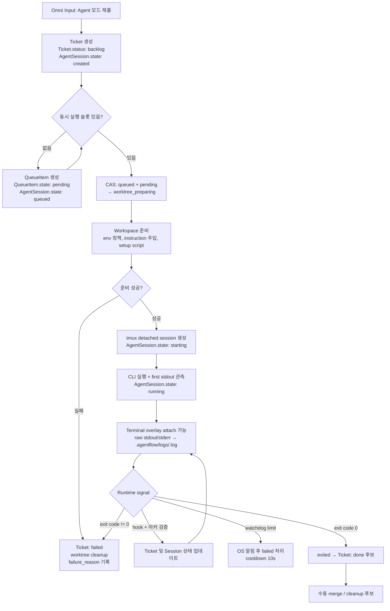
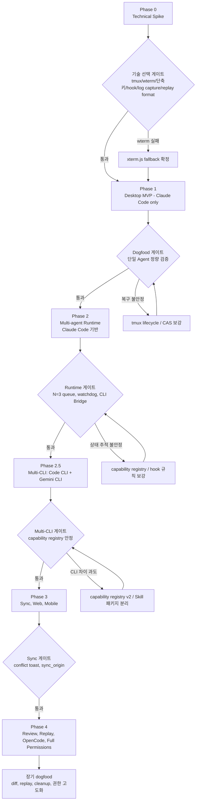

# 프로젝트 기획서 v4: Agentic Task & Terminal Manager (AgentFlow)

> **버전**: v4 (2026-05-17)
> **기준 문서**: `plan.v3.md`
> **작성 목적**: 4명 리뷰어 합의 사항(측정 정의, 상태 매핑, watchdog, log capture, env 정책, hook 규칙, 정량 dogfood 게이트)과 사용자가 선택한 4개 핵심 결정(tmux hard dep / worktree-scope yolo / raw log 파일 분리 / CLI phase 분리)을 plan에 반영. 자세한 리뷰 합의는 `code-reviews/plan-summary.md` 참조.

---

## 1. 방향성

**AgentFlow**는 개인 개발자를 위한 local-first 에이전트 작업 관리자이자 통합 터미널이다. 전역 단축키로 호출되는 플로팅 입력창에서 Task 또는 Agent 티켓을 만들고, Agent 티켓은 Mac 데스크톱에서 git worktree + tmux 세션으로 실행된다. Web/Mobile은 동일 보드 조회와 티켓 작성 중심이며, 실제 에이전트 실행은 Mac 클라이언트가 담당한다.

v4의 조정은 v3 overview에서 닫지 못한 결정 지점(측정 정의·상태 매핑·로그 저장 위치·CLI 우선순위·권한 기본값)을 plan 본문에서 닫는 것이다. 기능 범위는 v3과 동일하게 유지한다.

### 1.1 핵심 원칙

- **Mac desktop first**: 에이전트 실행, PTY, tmux, worktree, OS 알림은 Mac 데스크톱에서 먼저 완성한다.
- **Local-first before sync**: SQLite 기반 로컬 모델과 복구 가능성이 검증되기 전 Turso/Web/Mobile을 붙이지 않는다.
- **State machine first**: 칸반 UI보다 먼저 Ticket/AgentSession 상태 전이와 CAS 시맨틱을 명확히 정의한다.
- **Raw log always wins**: hook 파싱이나 상태 추론이 실패해도 원본 stdout/stderr는 파일로 남는다. 구조화 이벤트(SessionEvent)와 raw log는 저장소를 분리한다.
- **Single writer per artifact**: log capture는 `tmux pipe-pane`을 primary로 단일화한다. portable-pty는 Phase 0 PoC용으로만 유지한다.
- **Skill over protocol lock-in**: MCP 서버를 조기 도입하기보다, `agentflow` CLI와 각 에이전트용 Skill/Instruction 패키지로 호환성을 확보한다. MCP 재검토 트리거는 §3.5에 명시.
- **Yolo by default, worktree-scoped, visible by design**: yolo 실행은 기본값이지만 worktree 안에서만 허용되고, repo root에서는 차단된다. 변경 파일 수는 ticket 상세에 항상 표시된다. 완전한 권한 모델은 Phase 4.
- **tmux is a hard dependency**: v1은 tmux 미설치 환경을 지원하지 않는다. 최초 실행 시 dependency check가 실패하면 brew 설치 안내로 onboarding을 막는다.

---

## 2. 참고 프로젝트와 적용 범위

- **Muxy**: SwiftUI + libghostty 기반 AI 친화 터미널. 터미널 UX, 에이전트 세션 표시, AI 친화 패턴 참고 대상.
- **Conductor.build**: git worktree 기반 병렬 에이전트 작업과 결과 검토 흐름 참고.
- **Raycast / Spotlight**: 전역 단축키, 빠른 입력, foreground overlay 호출 패턴 참고.
- **Linear**: 키보드 중심 칸반, 빠른 이슈 생성, 상태 변경 UX 참고.
- **Cursor / Windsurf**: 에이전트-터미널-에디터 연결 UX 참고.

---

## 3. 기능 범위

### 3.1 옴니 인풋 플로팅 윈도우

#### 호출 단축키

기본값은 `Cmd+Shift+Space`이며, 사용자 설정에서 변경 가능하다. macOS 시스템 단축키와 충돌하면 Phase 0 통과 기준에 따라 fallback 단축키(예: `Cmd+Opt+Space`)를 제시한다.

#### 모드와 토글

Task / Agent 두 모드. 기본 토글은 `Shift+Tab`. 다만 **터미널 오버레이가 활성화된 동안에는 `Shift+Tab`을 모드 토글로 가로채지 않고 PTY로 전달한다.** 모드 토글은 오버레이 비활성 상태에서만 활성화된다.

#### Task 모드 / Agent 모드

Task 모드는 즉시 `backlog` 티켓을 생성한다. Agent 모드는 CLI(§3.4) · 모델 · 옵션 선택 후 Agent 티켓을 생성한다.

#### Agent 티켓 상태 (요약)

`backlog → queued → running → (waiting | failed | done)` 의 사용자 시점 흐름. 내부 `AgentSession.state`와의 매핑은 §3.2.

#### 최근값

workspace, CLI, 모델, 주요 옵션의 마지막 성공값을 저장한다.

#### 터미널 전환

Agent 실행 시 입력창이 터미널 오버레이로 확장되고 stdout/stderr를 실시간 표시한다.

### 3.2 칸반과 상태 모델

#### 데이터 모델

- `Ticket.type`: `task`, `agent`
- `Ticket.status`: `backlog`, `todo`, `queued`, `running`, `waiting`, `failed`, `done`, `archived`
- `Ticket.assignee_type`: `human`, `agent`, `none`
- `AgentSession.state`: `created`, `worktree_preparing`, `queued`, `starting`, `running`, `waiting_input`, `exited`, `failed`, `orphaned`, `recovered`
- `QueueItem.state`: `pending`, `active`, `completed`, `cancelled`

#### 작업 소요/규모 추적 필드 (v4 추가)

향후 "예상 대비 실제 소요·규모" 대시보드(§9 후속 문서화 대상)의 기반 데이터를 v1부터 수집한다. 별도 분석 테이블 없이 `Ticket` / `AgentSession`에 필드만 추가하고, 대시보드 UI는 Phase 4 이후로 이연한다.

- `Ticket.estimated_size`: 티켓 생성 시 사용자가 입력하는 작업 규모. 단위는 t-shirt 사이즈 enum (`xs`, `s`, `m`, `l`, `xl`). 미입력 허용(`null`).
- `Ticket.actual_size`: 티켓 완료(`done` 또는 `failed`) 시점에 확정되는 실제 규모. 기본은 사용자 입력, 미입력 시 `AgentSession` 누적 실행 시간 기반 휴리스틱으로 자동 추정(예: <15분=xs, <1h=s, <4h=m, <1d=l, ≥1d=xl). 자동 추정 여부는 `actual_size_source` (`user`, `auto`)로 구분.
- `Ticket.started_at`: 티켓이 처음 `running` 상태에 도달한 시각. Agent 티켓은 연결된 `AgentSession.state`가 `running`이 된 최초 시각, Task 티켓은 사용자가 `todo → running`으로 옮긴 시각. 한 번 set되면 이후 재실행에도 갱신하지 않는다(latency = `started_at - created_at`을 보존하기 위함).
- `Ticket.first_response_at`: Agent 티켓에서 첫 stdout 또는 첫 hook 이벤트 도달 시각. dogfood 정량 지표(§8 p50 ≤ 10초)의 source of truth.
- `AgentSession`은 기존 `started_at`, `finished_at`을 유지하되, 단일 티켓에 여러 세션이 붙는 경우(재실행) 누적 wall-clock은 sum(`finished_at - started_at`)로 계산한다.

위 필드는 모두 sync 대상에 포함되며(SessionEvent 제외 규칙과 별개), `sync_origin`을 따라 충돌 처리한다.

#### Ticket.status `todo`와 `archived`

- `todo`: Task 티켓이 사용자에 의해 명시적으로 시작 준비된 상태(드래그로 todo lane 진입). Agent 티켓은 사용하지 않는다.
- `archived`: `done` 또는 `failed`에서 사용자가 명시적으로 보낸 경우. 자동 archive는 v1에서 적용하지 않는다.

#### AgentSession.state ↔ Ticket.status ↔ UI 매핑 표

| AgentSession.state    | Ticket.status        | UI 표시 (Kanban)           |
| --------------------- | -------------------- | -------------------------- |
| created               | backlog              | Backlog                    |
| queued                | queued               | Agent lane — queued        |
| worktree_preparing    | queued               | Agent lane — preparing     |
| starting              | running              | Agent lane — starting      |
| running               | running              | Agent lane — running       |
| waiting_input         | waiting              | Agent lane — waiting       |
| exited (exit_code 0)  | done                 | Done lane                  |
| exited (exit_code !=0) | failed              | Attention lane             |
| failed                | failed               | Attention lane             |
| orphaned              | (직전 status 유지)   | Attention lane — orphaned  |
| recovered             | running              | Agent lane — recovered     |

UI 컬럼은 데이터 status를 그대로 노출하지 않아도 된다. `queued`/`waiting`은 Agent lane 내부 sub-state로 표시, `failed`/`orphaned`는 별도 attention lane으로 분리.

### 3.3 Agent 실행 파이프라인

#### 흐름도



#### "3초" 측정의 정의 (v4 명시)

- **포함**: Agent 모드 submit → DB row 생성 + UI에 `queued` 또는 `worktree_preparing` 표시까지.
- **제외**: worktree 생성, instruction 주입, `post_worktree`/`pre_agent` 스크립트 실행, dependency install, tmux 세션 생성, CLI 첫 stdout 출력.
- 위의 제외 항목은 별도 `worktree_preparing` / `starting` substate로 UI에 표시한다. 실제 `running` 도달 시간은 repo 크기·setup script 길이에 따라 변동하며, dogfood 정량 지표 항목으로 별도 측정한다(§8).

#### CAS 시맨틱 (상태 전이 프리컨디션)

- `created → queued`: `Ticket.status == backlog` AND 동시 슬롯 미충족.
- `queued → worktree_preparing`: `Ticket.status == queued` AND `QueueItem.state == pending`. CAS 실패 시 QueueItem은 다음 tick에 재시도, 5회 실패 시 `cancelled`.
- `worktree_preparing → starting`: workspace 준비 성공.
- `starting → running`: CLI 프로세스 PID 할당 AND stdout 첫 라인 관측. spawn 실패 또는 60초 내 첫 라인 없음 → `failed`.
- `running → waiting_input`: hook 마커 `<<<AGENTFLOW_HOOK>>> status=waiting_input <<<AGENTFLOW_HOOK_END>>>` 수신.
- `any → orphaned` (앱 재시작 시): §4.3의 orphaned 판정 매트릭스 참조.

#### Watchdog 아키텍처

- **위치**: Rust backend core 내 별도 tokio task. 1초 주기로 활성 `AgentSession`의 process tree(tmux pane → shell → CLI → 하위) RSS를 `proc_pid_rusage` (macOS)로 수집.
- **임계치**: per-session RSS 1.5GB (workspace 설정으로 override 가능). 시스템 전체 free memory가 500MB 미만이면 새 dequeue 일시 중단.
- **위반 시**: 세션을 `failed`로 전이, OS 알림 발송, 해당 슬롯을 10초 cooldown 상태로 유지(즉시 dequeue로 연쇄 실패 방지).
- **Watchdog crash recovery**: tokio task가 panic 시 Rust core가 자동 재시작. 재시작 후 첫 1초는 모든 세션을 healthy로 가정.

#### Hook 처리 규칙

- **시작·종료 마커**: `<<<AGENTFLOW_HOOK>>>` 와 `<<<AGENTFLOW_HOOK_END>>>` 사이의 1줄만 hook으로 인식. 마커 외부 또는 마커 불일치는 무시.
- **exit code 우선**: hook이 어떤 상태를 선언했든, 프로세스 종료 시 `exit_code != 0`이면 최종 상태는 `failed`.
- **Debounce**: 동일 세션에서 1초 이내 동일 필드 중복 hook은 마지막 것만 적용.
- **Dry-run 모드**: `AGENTFLOW_HOOK_DRY_RUN=1` 환경변수로 에이전트가 hook 출력을 테스트할 수 있다.

#### Raw log 저장 (v4 결정: 별도 파일)

- **경로**: `.agentflow/logs/<session-id>.log` (append-only).
- **단일 writer**: `tmux pipe-pane`이 직접 파일에 append. portable-pty는 v1 production path에 사용하지 않는다.
- **회전**: 세션당 10MB 초과 시 `<sid>.log.1`, `<sid>.log.2`로 순환. 최대 5개 파일 보관.
- **압축·삭제**: 완료된 세션의 로그는 30일 후 gzip 압축, 90일 후 자동 삭제. 정책은 workspace 설정으로 override 가능.
- **SessionEvent 테이블**: 구조화 이벤트(상태 전이, hook 결과, watchdog 알림)만 저장. raw stdout/stderr는 들어가지 않는다.
- **Replay**: Phase 4의 session replay는 raw log만으로 불가능하므로 별도 capture 형식(예: asciicast v2)을 Phase 0에서 검토하고 Phase 4에서 정한다. v1~v3은 raw log 표시(plain text)만 지원.

#### 파이프라인 단계 요약

1. Ticket 생성: Agent 모드 입력을 `backlog`에 기록 (`AgentSession.state = created`).
2. Queue 등록: 동시 실행 제한 확인 후 `queued`.
3. Worktree 생성: CAS 통과 후 `.agentflow/worktrees/<ticket-id>`에 worktree와 branch 생성.
4. Workspace 준비: env 정책 적용(§3.6), instruction 주입, 초기화 스크립트 실행.
5. tmux 세션 생성: `agentflow-<ticket-id>` 형식 detached session.
6. CLI 실행: 선택한 CLI별 command template과 옵션으로 프로세스 시작.
7. Log capture: `tmux pipe-pane`이 raw log 파일에 append.
8. State update: hook 마커, exit code, CLI Bridge, watchdog 이벤트로 갱신.
9. Recovery: 앱 재시작 시 SQLite metadata와 `tmux ls`를 §4.3 알고리즘으로 비교.

### 3.4 지원 CLI와 Phase 배치 (v4 결정: 분리)

| CLI          | Phase 도입       | 비고                                                    |
| ------------ | ---------------- | ------------------------------------------------------- |
| Claude Code  | Phase 1          | v1 dogfood의 1차 대상.                                  |
| Claude Code  | Phase 2          | Multi-agent runtime, queue, watchdog, CLI Bridge.       |
| Code CLI     | Phase 2.5 (신설) | capability registry 1차 구현 후 추가.                   |
| Gemini CLI   | Phase 2.5 (신설) | Code CLI와 함께. 둘 다 표준화 수준이 비교적 높음.       |
| OpenCode     | Phase 4 또는 spike | capability registry 안정화 + raw log adapter 검증 후. |

Phase 2 → 2.5 분리는 multi-agent runtime의 안정성 검증(Claude Code 단일)이 비-Claude CLI 추가의 선행 조건이라는 판단이다. OpenCode는 다른 3개 대비 표준화가 낮아 별도 spike로 분리한다.

### 3.5 CLI Bridge와 AgentFlow Skill

#### v1 CLI 명령

```bash
agentflow subtask add "리팩토링 1단계: 인터페이스 추출"
agentflow status update "$AGENTFLOW_TICKET_ID" done
agentflow comment add "$AGENTFLOW_TICKET_ID" "테스트 통과 확인"
```

#### 환경변수

- `AGENTFLOW_TICKET_ID`, `AGENTFLOW_WORKSPACE_ID`: 에이전트가 자신을 식별하는 데 사용.
- `AGENTFLOW_SOCKET`: Unix domain socket 경로 `${XDG_RUNTIME_DIR:-$TMPDIR}/agentflow-<workspace-id>.sock`. workspace 단위로 격리되어 다른 workspace의 socket에 접근 불가. multi-instance(여러 AgentFlow 동시 실행)는 v1 비지원.
- `AGENTFLOW_PROTOCOL_VERSION`: Skill 패키지 호환성을 위한 prototocol 버전. v1 명령 집합은 하위 호환성 보장.

#### Skill / Instruction 패키지

- 각 CLI별 instruction 파일 템플릿
- 위 환경변수 사용법
- 상태 업데이트 · 서브태스크 · 코멘트 예시
- 실패 시 raw log 보존과 수동 복구 절차

#### MCP 재검토 트리거 (v4 명시)

다음 중 하나라도 충족되면 MCP 도입을 v2+ 시점에 재검토한다.

- Skill 패키지로는 표현 불가능한 양방향 도구 호출이 누적 2회 이상.
- 지원 대상 CLI 중 2개 이상이 동일한 MCP profile을 stable로 표기.
- AgentFlow CLI 명령 수가 10개를 넘어 maintenance 부담이 명확해짐.

### 3.6 Worktree와 workspace 준비

#### 생성 경로

`.agentflow/worktrees/<ticket-id>`.

#### 브랜치

`agentflow/<workspace-slug>/<ticket-slug>-<ticket-id>` 형식.

#### Git remote 격리

worktree 생성 직후 `git config --local remote.origin.pushurl ""`로 push 차단(또는 `git config --local push.default nothing`). 명시적 사용자 액션이 있을 때만 push 가능. yolo 세션에서 `git push --force` 사고를 방지한다.

#### 초기화 스크립트

`post_worktree`, `pre_agent`를 workspace 설정으로 관리. "항상 실행"이 아니라 "workspace별 default + ticket별 override" 구조.

#### Instruction 주입

`CLAUDE.md`, `AGENTS.md`, 기타 CLI별 instruction 파일을 복사하거나 append.

#### Env / Secrets 정책 (v4: guided setup)

- **기본 원칙**: secrets는 자동 복사하지 않는다.
- **Guided setup (Phase 1 scope)**: workspace 최초 생성 시 root_path에서 `.env`, `.env.local`, `.envrc`를 자동 감지하고 "worktree에 복사하시겠습니까?"를 각 파일에 대해 묻는다.
- **API 키 주입**: `ANTHROPIC_API_KEY`, `OPENAI_API_KEY` 등은 workspace `.env.agentflow` 또는 macOS Keychain에서 로드. UI에서 명시적으로 등록.
- **검증**: workspace 생성 후 첫 Agent 실행 전에 "이 workspace는 어떤 env 파일이 필요합니까?" 단계가 한 번 강제된다.

#### Yolo 정책 (v4: worktree-scoped)

- **기본값**: yolo 모드는 v1부터 활성.
- **범위 제한**: yolo는 worktree 안에서만 허용된다. repo root에서 yolo 활성화는 차단된다.
- **가시성**: yolo 세션은 ticket 상세에 항상 `yolo` 뱃지 + `git status --porcelain`으로 측정한 "N files changed" 배지를 표시. 변경 파일 수가 100을 넘으면 추가 경고 배지.
- **완전한 권한 모델**: Phase 4. v1~v3에서는 worktree 격리 + git remote 차단 + diff 가시성으로만 보호.

#### 정리

Done 후 수동 머지/삭제 흐름. dirty worktree는 자동 삭제하지 않는다. `worktree_preparing` 실패 시 부분 생성된 worktree와 branch는 즉시 cleanup.

### 3.7 터미널 / PTY 전략 (v4: 단일화)

- **tmux는 v1 hard dependency**. 미설치 시 onboarding이 brew 설치 안내로 막힌다. portable-pty fallback path는 v1에 두지 않는다.
- **Log capture single source of truth**: `tmux pipe-pane`. portable-pty는 Phase 0 PoC용으로만 유지(향후 Windows 지원 등이 필요할 때 별도 spike).
- **터미널 렌더링**: wterm 우선 검증, 실패 시 xterm.js fallback을 Phase 0에서 결정한다.
- Phase 0 검증 항목은 §5 Phase 0에 정리.

### 3.8 Web/Mobile

Web은 Next.js를 기본 후보. Mobile은 React Native 기본 후보지만 Tauri v2 Mobile 활용 가능성을 Phase 3 진입 전에 별도 spike로 검토.

v1 범위는:

- 보드 조회
- Task 티켓 작성
- Agent 티켓 draft 작성
- Mac desktop에서 실행할 원격 trigger는 후속

---

## 4. 기술 아키텍처

### 4.1 레이어

- **Desktop app**: Tauri v2 + React + TypeScript
- **Backend core**: Rust command handlers + SQLite
- **Terminal**: wterm 우선, xterm.js fallback (Phase 0 결정)
- **Session manager**: tmux (hard dependency)
- **PTY**: portable-pty는 Phase 0 PoC용으로만. v1 production은 tmux pipe-pane.
- **Local DB**: SQLite (구조화 데이터)
- **Local log storage**: `.agentflow/logs/<sid>.log` 파일 (raw stdout/stderr)
- **Sync**: Turso/libSQL Embedded Replica (Phase 3+)
- **Web**: Next.js
- **Mobile**: React Native 또는 Tauri v2 Mobile (Phase 3 spike)
- **Agent control**: `agentflow` CLI + Unix domain socket + Skill/Instruction 패키지

### 4.2 데이터 모델 보강

```text
Workspace
  id, name, slug, root_path, default_branch
  permission_mode, default_cli_tool, default_model
  post_worktree_script, pre_agent_script
  instruction_policy_json, env_copy_policy_json
  log_retention_policy_json
  created_at, updated_at

Ticket
  id, workspace_id, type, title, description
  status, assignee_type, parent_ticket_id
  priority, created_at, updated_at, completed_at
  started_at, first_response_at
  estimated_size, actual_size, actual_size_source
  sync_version, sync_origin, last_local_event_id

AgentSession
  id, ticket_id, cli_tool, model, options_json
  state, tmux_session_name, worktree_path, branch_name
  pid, process_group_id, started_at, finished_at
  exit_code, failure_reason, raw_log_path

SessionEvent      # 구조화 이벤트만, raw stdout/stderr 미포함
  id, session_id, ticket_id, ts, sequence
  kind, payload, local_only

QueueItem
  id, ticket_id, workspace_id, priority
  state, enqueued_at, started_at, completed_at, retry_count

Comment
  id, ticket_id, author_type, body
  created_at, sync_version, sync_origin
```

#### v4 추가 필드

- `Ticket.sync_origin` / `Comment.sync_origin`: device_id. Phase 3 conflict UI의 기반.
- `Ticket.started_at` / `Ticket.first_response_at`: §3.2 작업 소요/규모 추적용. latency·delay·dashboard 지표의 source of truth.
- `Ticket.estimated_size` / `Ticket.actual_size` / `Ticket.actual_size_source`: §3.2 t-shirt 사이즈 enum과 자동 추정 출처 구분.
- `AgentSession.raw_log_path`: 별도 파일 경로 명시.
- `SessionEvent.sequence`: 동일 ms 내 이벤트 순서 보장(local DB 단위 monotonic).
- `QueueItem.retry_count`: CAS 실패 재시도 카운터.
- `Workspace.log_retention_policy_json`: 회전/압축/삭제 정책 override.

#### Sync 정책

- 동기화 대상: Workspace, Ticket, Comment, 일부 AgentSession metadata(상태 + 시작/종료 시각).
- 동기화 제외: `SessionEvent`, raw log 파일, `AgentSession.options_json` 중 secrets.
- Conflict 감지: `sync_version` 낙관적 락. 동일 ticket의 동일 필드가 서로 다른 `sync_origin`에서 동시에 갱신되면 last-write-wins를 적용하기 전에 두 버전을 사이드바이사이드 conflict toast로 표시. 사용자는 `keep mine` / `accept theirs` 중 선택.
- libSQL Embedded Replica는 write를 primary로 proxy하므로 application layer에서 충돌 resolution을 책임진다.

### 4.3 상태 전이 원칙

- UI drag/drop은 `Ticket.status`를 변경한다.
- Agent runtime은 `AgentSession.state`를 변경하고 §3.2 매핑 표에 따라 `Ticket.status`를 갱신한다.
- 모든 상태 전이는 §3.3의 CAS 프리컨디션을 통과해야 한다.

#### Orphaned 판정 매트릭스 (앱 재시작 시)

| AgentSession.state (재시작 직전) | `tmux ls`에 존재 | PID 확인 | 결과         |
| ---------------------------------- | ---------------- | -------- | ------------ |
| starting / running / waiting_input | 있음             | 살아 있음 | `recovered`  |
| starting / running / waiting_input | 있음             | 죽음     | `orphaned`   |
| starting / running / waiting_input | 없음             | —        | `failed`     |
| 그 외 (`exited`, `failed`, `done`) | 있음             | —        | `orphaned` (cleanup 후보) |
| 그 외                              | 없음             | —        | 유지         |

- PID reuse 오탐 방지를 위해 `proc_pidpath` 결과를 `AgentSession.tmux_session_name`과 함께 검증.
- `orphaned` 상태에서는 사용자에게 "복구 시도 / 종료" 선택지 제공.

---

## 5. Phase 계획



#### 게이트 회귀 규칙 (v4 신설)

이후 phase에서 이전 phase의 통과 기준이 회귀하면, 해당 phase 진행을 중단하고 회귀 항목 복구를 phase plan의 일부로 포함한다. 게이트는 unidirectional이 아니다.

### Phase 0 — Technical Spike

**목표**: 핵심 기술 선택이 가능한지 검증한다.

필수 작업:

- Tauri v2 + React shell 생성
- 글로벌 단축키 등록/해제 검증
- **단축키 충돌 검증**: 기본값 `Cmd+Shift+Space`가 macOS Sonoma/Sequoia 기본 설정과 충돌하지 않거나, 충돌 시 fallback 단축키 제시
- wterm 렌더링 spike와 xterm.js fallback 비교
- tmux 설치 확인, session 생성, attach/detach, **pipe-pane을 단일 log writer로 검증**
- SQLite migration 방식 결정
- macOS notification click-to-focus 검증
- Claude Code 단일 spawn PoC + **hook round-trip PoC**(status update 1회를 hook → CLI Bridge → DB까지)
- **Session replay capture format 검토** (asciicast v2 / ttyrec / script)
- **Raw log 파일 저장 vs SessionEvent 테이블 stress test** (N=3 동시 실행, SQLITE_BUSY 0건 확인)

통과 기준:

- 전역 단축키로 floating window를 열 수 있다 (충돌 또는 fallback 결정).
- tmux detached session이 앱 종료 후에도 살아남는다.
- raw stdout/stderr가 `.agentflow/logs/<sid>.log`에 유실 없이 append된다.
- log capture writer가 단일(`tmux pipe-pane`)임이 확정된다.
- hook round-trip이 1회 이상 성공 (실패 시 Phase 1에서 polling/watchdog 기반으로 조정).
- session replay capture format 후보 1개 이상 결정.
- wterm 사용 여부 결정. 실패 시 xterm.js fallback을 v1 기본값으로 확정.

### Phase 1 — Desktop MVP (Claude Code only)

**목표**: Mac에서 단일 workspace, 단일 Agent 실행, 칸반 복구까지 dogfood 가능한 최소 제품을 만든다. CLI는 Claude Code 1개로 고정.

포함 범위:

- **최초 실행 dependency check + onboarding** (tmux, git, Accessibility 권한, 단축키 권한). 미충족 시 액션 버튼.
- Workspace CRUD + **env guided setup wizard**
- Task / Agent omni input
- Agent 티켓 생성 후 Backlog 등록
- Claude Code 실행 (다른 CLI 없음)
- git worktree 생성 + **git remote pushurl 차단**
- tmux detached session
- terminal overlay attach/detach
- SQLite 기반 Ticket / AgentSession / SessionEvent 저장
- **`.agentflow/logs/<sid>.log` 파일 기반 raw log capture + 회전 정책**
- 앱 재시작 시 tmux 세션 복구 (orphaned 매트릭스 §4.3)
- **yolo mode worktree-scoped + "N files changed" 배지**
- Open in Editor
- Markdown raw/rendered viewer

제외 범위:

- Turso sync
- Web/Mobile
- 다중 CLI
- 정교한 권한 정책 (denylist 일부는 §3.6의 git remote 차단으로 최소 확보)
- replay/diff 고급 UI

통과 기준:

- floating input에서 Agent 티켓을 만들고 **3초 내 `Ticket.status = queued` 또는 `AgentSession.state = worktree_preparing` 표시**.
- 앱을 강제 종료해도 tmux session과 raw log 파일이 남는다.
- 앱 재시작 후 진행 중 세션을 칸반에서 다시 attach할 수 있다 (orphaned 복구 흐름 포함).
- worktree가 원본 repo와 분리되어 변경사항을 만든다.
- worktree 안에서 `git push` 시도가 차단된다.

### Phase 2 — Multi-agent Runtime (Claude Code 기반)

**목표**: 여러 Claude Code 에이전트를 안전하게 병렬 실행하고, 상태/알림/대기열을 안정화한다. 비-Claude CLI는 Phase 2.5로 분리.

포함 범위:

- 동시 실행 제한 기본 N=3
- QueueItem 기반 `queued` 상태 + CAS retry
- 메모리 watchdog (Rust core, per-session + system-wide free 메모리 체크)
- Failed 후 10초 cooldown
- OS 알림: 완료, 실패, 승인/입력 대기, 메모리 임계치, **queue 5분 초과 대기**
- hook 기반 상태 업데이트 (마커, debounce, dry-run)
- `agentflow` CLI Bridge
- AgentFlow Skill/Instruction 패키지 초안 (Claude Code 1개 분량)
- 서브태스크 생성 및 칸반 반영
- **capability registry 1차 구현 (Claude Code 1개 entry만이지만 추상 인터페이스 확정)**

통과 기준:

- 동시에 3개 Claude Code Agent를 실행하고 4번째는 `queued`로 유지.
- CLI Bridge로 생성한 subtask가 parent ticket 아래에 기록.
- 한 세션 실패가 다른 세션의 상태와 worktree를 손상하지 않음.
- watchdog 이벤트가 ticket status와 notification으로 이어짐.
- raw log 파일 회전이 작동 (10MB 초과 시 .log.1 생성).

### Phase 2.5 — Multi-CLI (Code CLI + Gemini CLI)

**목표**: capability registry로 비-Claude CLI를 추가하고, Skill 패키지를 CLI별로 분리.

포함 범위:

- Code CLI / Gemini CLI 추가
- CLI별 옵션 form
- capability registry 확장 (CLI별 hook 형식, env 변수, instruction 파일 차이)
- Skill 패키지 CLI별 분리 + `AGENTFLOW_PROTOCOL_VERSION`

통과 기준:

- 동일 ticket을 CLI만 바꿔 실행 가능.
- capability registry가 새 CLI 1개 추가 시 plan 변경 없이 수용.
- Skill 패키지가 CLI별로 격리되며 v1 명령 집합과 하위 호환.

### Phase 3 — Sync, Web, Mobile

**목표**: Desktop local-first 모델을 유지하면서 Web/Mobile 조회와 티켓 작성 흐름을 붙인다.

포함 범위:

- Turso/libSQL Embedded Replica
- sync 대상 테이블 확정 (SessionEvent · raw log 제외)
- conflict policy: `sync_version` + sync_origin + side-by-side conflict toast
- Web board viewer/writer
- Mobile board viewer/writer
- Mobile 기술 선택 spike: React Native vs Tauri v2 Mobile
- 로그/세션 이벤트 동기화 제외 정책 구현

통과 기준:

- Mac에서 만든 Task 티켓이 Web/Mobile에 반영.
- Web/Mobile에서 만든 Task 티켓이 Mac desktop에 반영.
- Agent raw log는 sync되지 않음.
- 동일 ticket·동일 필드 충돌 발생 시 silent overwrite가 아니라 side-by-side toast 표시.

### Phase 4 — Review, Replay, Polish, OpenCode

**목표**: dogfood 중 반복적으로 필요한 검토/정리/검색 기능, OpenCode 추가, 완전한 권한 모델.

포함 범위:

- Diff viewer
- Session replay (Phase 0에서 결정한 capture format 기반)
- prompt history search
- file tree와 read-only code viewer
- worktree cleanup assistant
- **권한 모델 고도화** (network/git/file 단위 allow/deny/prompt)
- **OpenCode 추가** (capability registry 검증 후)
- AgentFlow Skill 패키지 개선

통과 기준:

- 완료된 Agent 티켓 변경사항을 앱 안에서 검토 가능.
- 오래된 worktree/log 정리 후보를 안전하게 식별.
- 권한 모드가 workspace별로 명확히 표시되고 변경 가능.
- OpenCode가 capability registry로 다른 CLI와 동일 인터페이스로 동작.

---

## 6. 주요 리스크와 대응

### tmux 미설치 (v4: hard dep)

- 영향: 신규 환경에서 실행 불가.
- 대응: 앱 시작 시 dependency check가 onboarding을 차단하고 brew 설치 안내를 제공한다. v1은 fallback path를 두지 않는다. 향후 portable-pty fallback이 필요해지면 별도 spike로 결정.

### wterm 통합 불안정

- 영향: v1 일정 지연.
- 대응: Phase 0에서 결정. xterm.js를 즉시 대체 경로로 유지.

### CLI별 동작 방식 차이

- 영향: 상태 추적 불안정.
- 대응: Phase 2에서 capability registry 1차, Phase 2.5에서 비-Claude CLI 추가, Phase 4에서 OpenCode 검증.

### hook 파싱 실패

- 영향: 칸반 상태 부정확.
- 대응: 마커·debounce·exit code 우선·dry-run 규칙. raw log 파일 보존이 최종 safety net.

### worktree 초기화 지연

- 영향: 사용자 대기 체감.
- 대응: "3초"는 queued/`worktree_preparing` 표시까지로 한정. 실제 running 도달 시간은 정량 지표로 별도 측정. workspace별 setup script 캐시/skip 옵션.

### raw log 무한 증가

- 영향: 디스크 고갈.
- 대응: 세션당 10MB 회전, 30일 후 압축, 90일 후 삭제. workspace 단위 override.

### SessionEvent + raw log 동일 SQLite 충돌

- 영향: SQLITE_BUSY, write contention.
- 대응: raw log를 SQLite에서 분리해 파일 저장 (v4 결정). SessionEvent는 구조화 이벤트만.

### secrets 자동 복사 위험 vs broken-by-default UX

- 영향: 보안 사고 또는 dogfood 이탈.
- 대응: 기본 비활성 + workspace 생성 시 guided setup wizard (Phase 1 scope).

### yolo mode 위험

- 영향: 원치 않는 변경.
- 대응: worktree-scope 강제, repo root에서 yolo 차단, ticket 상세에 "N files changed" 배지, git remote pushurl 차단.

### 앱 크래시

- 영향: UI 상태 유실.
- 대응: tmux + SQLite metadata + raw log 파일 + orphaned 매트릭스로 복구.

### 시스템 OOM

- 영향: 세션 강제 종료.
- 대응: per-session RSS + 시스템 free 메모리 watchdog + failed 후 10초 cooldown.

### Turso 충돌

- 영향: 상태 뒤섞임.
- 대응: Phase 3까지 이연. `sync_version` 낙관적 락 + side-by-side conflict toast. libSQL Embedded Replica의 application-layer resolution 책임 명시.

### Mobile 기술 선택 불확실

- 영향: 중복 구현 비용.
- 대응: Phase 3 직전 spike로 결정.

### 전역 단축키 충돌

- 영향: dogfood 첫 분 실패.
- 대응: Phase 0 통과 기준에 충돌 검증과 fallback 단축키.

### Session replay 데이터 부족

- 영향: Phase 4 재설계 비용.
- 대응: Phase 0에서 capture format 후보 결정.

---

## 7. v4에서 보강된 결정 사항

- **측정 정의**: "3초"는 queued/worktree_preparing 표시까지로 한정. 실제 running 도달 시간은 별도 정량 지표.
- **상태 매핑**: AgentSession.state ↔ Ticket.status ↔ UI 매핑 표 추가. 각 전이에 CAS 프리컨디션. orphaned 판정 매트릭스.
- **Watchdog 아키텍처**: Rust core 내 tokio task, per-session RSS + 시스템 free 메모리, failed 후 10초 cooldown.
- **Hook 처리**: 시작·종료 마커, exit code 우선, debounce, dry-run 모드.
- **Raw log 저장 (v4 결정)**: SessionEvent 테이블에서 분리. `.agentflow/logs/<sid>.log` append-only 파일. 회전·압축·삭제 정책.
- **tmux는 hard dependency (v4 결정)**: portable-pty fallback은 v1에 두지 않음. log capture는 `tmux pipe-pane` 단일 writer.
- **CLI Phase 분리 (v4 결정)**: Phase 1 Claude Code only, Phase 2 multi-agent (Claude Code), Phase 2.5 Code/Gemini CLI 추가, Phase 4 OpenCode.
- **권한 v1 (v4 결정)**: yolo는 worktree-scope로 제한, repo root에서 차단. ticket에 "N files changed" 배지. git remote pushurl 차단. 완전한 권한 모델은 Phase 4.
- **Env 정책**: workspace 생성 시 guided setup wizard. broken-by-default 시나리오 차단.
- **Sync**: `sync_version` + `sync_origin` + side-by-side conflict toast.
- **Phase 0 추가 게이트**: 단축키 충돌 검증, hook round-trip PoC, log capture 단일화 stress test, session replay capture format 후보.
- **Phase 게이트 회귀 규칙**: 이전 phase 항목이 회귀하면 현 phase 진행 중단.
- **MCP 재검토 트리거**: 양방향 도구 호출 2회 이상, CLI 2개 이상 MCP stable, AgentFlow CLI 명령 10개 초과 중 하나라도 충족 시.

---

## 8. v1 Dogfood 검증 기준

#### 기능 체크리스트

- [ ] 전역 단축키로 floating input이 열린다.
- [ ] Task 모드 입력이 Backlog 티켓으로 저장된다.
- [ ] Agent 모드 입력이 Backlog 티켓으로 저장되고 §3.2 매핑에 따라 상태가 이동한다.
- [ ] Claude Code Agent가 worktree 안에서 실행된다.
- [ ] worktree 안에서 `git push` 시도가 차단된다.
- [ ] 앱 종료 후에도 tmux session과 raw log 파일이 살아 있다.
- [ ] 앱 재시작 후 진행 중 session을 orphaned 매트릭스에 따라 복구하고 attach 가능.
- [ ] 동시에 3개 Agent까지 실행되고 초과분은 `queued` 상태로 남는다.
- [ ] yolo mode가 worktree-scope로 제한되고 "N files changed" 배지가 표시된다.
- [ ] workspace 생성 시 env guided setup wizard가 1회 강제된다.

#### 정량 지표 (v4 추가)

- [ ] 1주일 dogfood 기간 raw log 유실 0건.
- [ ] 앱 강제 종료 후 orphaned 세션 복구 성공률 100% (샘플 5회 이상).
- [ ] Agent 티켓 생성에서 첫 stdout 출력까지 p50 ≤ 10초 (Claude Code 기준, 평균 repo 크기).
- [ ] N=3 동시 실행 30분 stress test에서 `SQLITE_BUSY` 0건.

#### 보조 지표 (self-report, v3에서 격하)

- [ ] 1주일 dogfood 후 기존 단일 터미널 워크플로우보다 작업 추적이 개선됐다고 판단한다.

---

## 9. 다음 문서화 대상

각 phase 시작 시점에는 이 overview plan을 그대로 구현하지 말고, 해당 phase 전용 세부 planning 문서를 별도로 작성한다.

- Phase 0: technical spike checklist (단축키 충돌·hook round-trip·log capture·replay format 포함) + decision log
- Phase 1: SQLite schema, state machine + CAS 시맨틱, Tauri command API, tmux lifecycle, env guided setup 상세 설계
- Phase 2: capability registry, queue/watchdog 알고리즘, notification matrix, Skill 패키지 상세
- Phase 2.5: capability registry 확장, Code CLI / Gemini CLI hook 차이, Skill 패키지 CLI별 분리
- Phase 3: sync schema, conflict UI, Web/Mobile 기술 선택 결과
- Phase 4: diff/replay UX, OpenCode adapter, full permission model 설계
- Phase 4+ (별도): **작업 소요·규모 대시보드** — `Ticket.estimated_size` vs `actual_size`, `created_at → started_at` latency, `started_at → completed_at` duration, AgentSession 누적 wall-clock을 집계해 워크스페이스/CLI/티켓 유형별 예측치와 지연 추이를 시각화. v1~Phase 3은 필드 수집만, 분석 UI는 충분한 데이터(최소 50개 이상 완료 티켓) 축적 후 설계.
